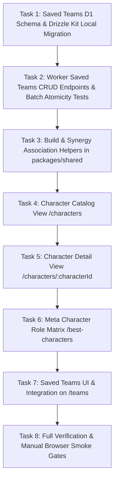

# Phase 6 — Character, Build & Team Recommender Surfaces

Status: Complete & Verified (All 5 Manual Smoke Gates PASS, Local D1 Persistence Verified, All Automated Validation Gates PASS). Target: Local Development. Date: 2026-09-04.  
Governance: Anchored in Decision [D-004](file:///c:/Users/Hafizh%20Rizqullah/Documents/Code/_active/Astralyn/docs/14-DECISIONS.md#d-004--recommendation-style), [D-005](file:///c:/Users/Hafizh%20Rizqullah/Documents/Code/_active/Astralyn/docs/14-DECISIONS.md#d-005--source-requirement), [D-006](file:///c:/Users/Hafizh%20Rizqullah/Documents/Code/_active/Astralyn/docs/14-DECISIONS.md#d-006--recommendation-authority), [D-025](file:///c:/Users/Hafizh%20Rizqullah/Documents/Code/_active/Astralyn/docs/14-DECISIONS.md#d-025--version-45-factual-integrity-fact-provenance-9-combat-paths--runtime-byte-checksums), [D-028](file:///c:/Users/Hafizh%20Rizqullah/Documents/Code/_active/Astralyn/docs/14-DECISIONS.md#d-028--phase-5-deterministic-scoring-policy--versioned-engineering-heuristics), and [D-029](file:///c:/Users/Hafizh%20Rizqullah/Documents/Code/_active/Astralyn/docs/14-DECISIONS.md#d-029--phase-6-deterministic-build-association-saved-teams-persistence--truthful-editorial-boundaries).

---

## 1. Executive Summary & Canonical Objectives

Phase 6 delivers the primary analytical, character build, and team management surfaces of Astralyn: the **Character Database**, the **Character Build & Detail Dossier**, the **Meta Character Role Matrix**, and **User-Curated Saved Teams**. It connects the static canonical game knowledge published in Phase 2 with the user's authenticated roster state from Phase 4 and the deterministic recommendation engine delivered in Phase 5.

### Primary Objectives:
1. **Character Database Grid (`/characters`):** Replace placeholder with an interactive, filterable character catalog displaying all 9 verified canonical characters with rarity, combat path, combat element, primary role tags, and live ownership indicators from the user's D1 roster.
2. **Character Detail & Build Dossier (`/characters/:characterId`):** Implement comprehensive character dossier views providing:
   - Full base stats (HP, ATK, DEF, SPD, Taunt, Crit Rate, Crit DMG, Energy pool / special resource);
   - Complete kit descriptions (Basic, Skill, Ultimate, Talent, Technique, Enhanced abilities, Memosprite skills);
   - Major Traces (A2, A4, A6) and Eidolons (E1–E6) with key mechanic highlights;
   - Truthful build associations: "Path-Compatible Light Cones" (strictly path-compatible options `wearer.path === cone.path`; signature designation is omitted as canonical fixtures lack a machine-readable signature relationship field) and "Mechanically Synergistic Relics" (associated via shared mechanic tags). No "Best-in-Slot" claims or invented rankings;
   - Consolidated honest unavailable editorial state acknowledging that multi-source comparison (Prydwen, Game8, Guobie) is scheduled for Phase 8. No fake empty 3-source rank cards;
   - Grounded "Best Team From My Roster" recommender, dynamically calling the exported Phase 5 deterministic engine (`generateTeamRecommendations` from `@astralyn/shared`) with `focusCharacterId: characterId`;
   - Explicit teammate synergy pairing cards directly reusing Phase 5 deterministic scoring logic (`packages/shared/src/recommendation/scoring.ts`). Zero duplicate recommendation systems;
   - "Save Team" action to bookmark the top recommended team directly into the user's Saved Teams.
3. **Meta Character Role Matrix (`/best-characters`):** Deliver a mode-neutral combat role taxonomy (Sustain, Primary Carry, Amplifier) grounded in canonical tags (`roles`, `path`, `element`) and user's owned-roster readiness. Exclude unverified mode suitability scores (MoC/PF/AS) and fabricated S/S+/A tier lists.
4. **Saved Teams Management & D1 Persistence (`saved_teams`, `saved_team_members`):** Implement explicit user-curated team persistence in Cloudflare D1 with an authenticated CRUD API, cascade deletion, 1–50 char trimmed name validation, and EXACTLY 4 unique canonical members. Recommendation generation itself remains 100% zero-persistence per D-028.
5. **Generic Visual Fallback Invariant:** Production UI exclusively renders generic geometric/silhouette vector fallback icons (`<GameAssetImage>`). Dev-only candidate visual assets remain strictly quarantined under `manual_review`.

---

## 2. Canonical Data & Build Classification Audit

To ensure complete source truthfulness and eliminate hallucinated rankings, Phase 6 partitions all build and character data into three distinct architectural classes:

| Data Class | Scope & Content | Examples in Phase 6 | Presentation & Label Policy |
|---|---|---|---|
| **1. Canonical Fact** (Tier A Authoritative) | Official game mechanics, multipliers, base stats, paths, elements, trace constraints, and release metadata verified in Version 4.5 baseline. | Base stats at Lv.80; Acheron non-energy Slashed Dream resource; Path compatibility constraint (`wearer.path === cone.path`). | Displayed as official facts with `FactProvenance`. |
| **2. Deterministic Engineering Association** (Astralyn Heuristic) | Pure deterministic algorithms mapping compatible options and kit synergies without subjective ranking. | Filter light cones matching wearer path; match relic sets with character `mechanicTags` (e.g. `break_effect` -> `iron-cavalry`, `debuff` -> `pioneer-diver`); calculate teammate synergies via Phase 5 scoring engine. | Truthful labels: **"Path-Compatible Light Cones"**, **"Mechanically Synergistic Relics"**, **"Kit Synergy Teammates"**. Never labeled as "Best-in-Slot". |
| **3. Unavailable Editorial Ranking** (Tier C Third-Party) | Subjective meta tier lists (S+/S/A), numerical BiS equipment rankings (#1, #2, #3), substat curves, and guide consensus. | Prydwen build tiers, Game8 rankings, Guobie guides. | **EXPLICITLY UNAVAILABLE.** Render single truthful notice: *"Editorial source comparison pending automated ingestion pipeline in Phase 8."* No fabricated rank cards. |

### Data Availability Matrix:

| Data Domain | Status in Repository | Exact Evidence | Treatment in Phase 6 |
|---|---|---|---|
| **Canonical Characters** | **AVAILABLE (9 Verified)** | `CANONICAL_CHARACTERS` in `canonical-fixtures.ts` (`acheron`, `aventurine`, `aventurine-waveflair`, `castorice`, `firefly`, `gallagher`, `robin`, `the-herta`, `tingyun`). | Full catalog grid, character detail dossiers. Live ownership from D1 `user_roster`. |
| **Canonical Light Cones** | **AVAILABLE (9 Verified)** | `CANONICAL_LIGHT_CONES` in `canonical-fixtures.ts`. | Filtered path-compatible light cones (`wearer.path === cone.path`). Signature LC support is **NO** (no machine-readable relationship). |
| **Canonical Relic Sets** | **AVAILABLE (6 Verified)** | `CANONICAL_RELICS` in `canonical-fixtures.ts`. | Associated via mechanic tag matching (e.g. `break_effect`, `debuff`). |
| **User Roster State** | **AVAILABLE** | Cloudflare D1 `user_roster` (Level, Eidolon, isOwned). | Owned badges, candidate roster for team generation. |
| **Recommendation Engine** | **AVAILABLE** | Pure integer fixed-point engine in `@astralyn/shared` (D-028). | Reused directly for "Best Team From My Roster" on character detail. |
| **Saved Teams Persistence** | **SPECIFIED IN DATA MODEL** | `docs/04-DATA_MODEL.md` (lines 43–55), Drizzle schema required. | Minimum D1 schema (`saved_teams`, `saved_team_members`), Drizzle Kit generated local migration, atomic D1 batch CRUD API. |
| **BiS Editorial Rankings** | **MISSING / UNAVAILABLE** | No editorial ranking dataset exists. | **UNAVAILABLE.** Labeled as "Path-Compatible Light Cones" and "Mechanically Synergistic Relics". |
| **Mode Suitability (MoC/PF/AS)** | **MISSING / UNAVAILABLE** | No mode-specific scoring rules exist in canonical fixtures. | **EXCLUDED.** Surfaces show mode-neutral mechanical role taxonomy. No S/S+/A tiers. |
| **Tier C Editorial Sources** | **MISSING / NOT INGESTED** | Scraper feeds scheduled for Phase 8. | **UNAVAILABLE.** Single consolidated notice. Zero fake rank cards. |
| **Relic Substat Optimizer** | **EXPLICITLY EXCLUDED** | Excluded in `docs/02-MVP_SCOPE.md`. | **OUT OF SCOPE.** |

---

## 3. Surface Specifications & User Workflows

### Surface 1: Character Catalog (`/characters`)
- **Header:** Search bar (text normalization), active filter pills:
  - Combat Path (9 Paths: Destruction, Hunt, Erudition, Harmony, Nihility, Preservation, Abundance, Remembrance, Elation);
  - Combat Element (7 Elements: Physical, Fire, Ice, Lightning, Wind, Quantum, Imaginary);
  - Rarity (5★ Gold, 4★ Purple);
  - Ownership Filter (All / Owned Only / Missing).
- **Grid Layout:** Responsive card grid (1 col mobile, 2 tablet, 3–4 desktop).
- **Character Card:**
  - Resilient vector silhouette fallback `<GameAssetImage>` with rarity border;
  - Localized name and title;
  - Combat Element icon and Path icon;
  - Primary combat role tags (e.g. `Hypercarry DPS`, `Debuffer`);
  - Live ownership status pill: `Owned Lv.80 E0` or `Unowned`;
  - Action: Clicking card navigates to `/characters/:characterId`.

### Surface 2: Character Build & Detail Dossier (`/characters/:characterId`)
- **Route:** `/characters/:characterId` (dynamic route).
- **Section A: Character Header & Dossier Summary:**
  - Name, localized title, rarity badge, element badge, path badge;
  - Base stats overview at Lv. 80 (HP, ATK, DEF, SPD, Taunt, Crit Rate, Crit DMG, Energy pool);
  - Special resource indicator (e.g. Acheron `Slashed Dream / Crimson Knot`, Aventurine • Waveflair `Punchline / Fervor`);
  - Ownership status badge with quick link to `/roster`.
- **Section B: Abilities & Kit Breakdown:**
  - Tabs: Basic ATK, Skill, Ultimate, Talent, Technique, Enhanced abilities, Memosprite skills;
  - Major Traces (A2, A4, A6) with ascension requirements;
  - Eidolons (E1–E6) highlighting key game-changing mechanics.
- **Section C: Build Guidance (Truthful Engineering Labels):**
  - **Path-Compatible Light Cones Panel:**
    - Light cones matching wearer's Combat Path (`wearer.path === cone.path`);
    - Superimposition scaling breakdown;
    - Note: *"Filtered strictly by Path compatibility. Numerical rankings and signature distinctions require editorial ingestion in Phase 8."*
  - **Mechanically Synergistic Relics Panel:**
    - Synergistic 4-piece Cavern Relic set with active 2pc/4pc set bonuses;
    - Synergistic 2-piece Planar Ornament set with active 2pc bonus;
    - Grounded explanation based on shared mechanic tags (e.g. `Iron Cavalry Against Scourge` paired with Firefly's `break_effect`);
    - Label: *"Mechanically Synergistic Relics (Associated via kit mechanic tags; substat curves out of scope)"*.
- **Section D: Multi-Source Editorial Consensus (Honest Representation):**
  - Consolidated truthful notification banner:
    > **Editorial Consensus Unavailable**  
    > Multi-source comparison across external guides (Prydwen, Game8, Guobie) is scheduled for the automated ingestion pipeline in Phase 8. No third-party editorial data is currently ingested.
  - Zero empty or simulated 3-source ranking cards.
- **Section E: "Best Team From My Roster" (Phase 5 Engine Integration):**
  - Queries exported Phase 5 deterministic engine (`generateTeamRecommendations` from `@astralyn/shared`) with `focusCharacterId: characterId`;
  - Displays top 4-character team card with rank, composite score, role breakdown, and reason codes;
  - Button: **"Save to My Teams"** &rarr; invokes `POST /api/saved-teams` with the exact 4 team members;
  - Handles insufficient roster (< 4 owned) with prompt to visit `/roster`;
  - Handles unowned character with clear note: *"Recommendations evaluated assuming character is available"*.
- **Section F: Kit Synergy Teammates:**
  - Evaluated using Phase 5 scoring engine logic (`packages/shared/src/recommendation/scoring.ts`);
  - Highlights top synergy pairings (e.g. Aventurine -> Acheron debuff feeding, Gallagher -> Firefly break synergy, Tingyun -> energy battery).

### Surface 3: Meta Character Role Matrix (`/best-characters`)
- **Route:** `/best-characters`.
- **Header:** Title, game patch badge (`Version 4.5 Verified`), transparent notice:
  *"Evaluated strictly on canonical combat role taxonomy. Subjective community tier lists (S+/S/A) and unverified game mode suitability rankings are not ingested."*
- **Role Taxonomy Matrix:**
  - **Sustain Specialists:** Shielders and Healers (`aventurine`, `gallagher`);
  - **Primary Carries:** Hypercarries, Break Carries, Elation Carries (`acheron`, `castorice`, `firefly`, `the-herta`, `aventurine-waveflair`);
  - **Amplifiers:** Buffers and Batteries (`robin`, `tingyun`).
- **Roster Readiness Summary:**
  - Shows user's owned characters mapped into each role category, highlighting roster gaps.

### Surface 4: Saved Teams Management (`/teams`)
- **Route:** `/teams` (updated from Phase 5 placeholder).
- **Functionality:**
  - Lists all user-curated saved teams fetched from `GET /api/saved-teams`;
  - Displays team name, mode badge, 4 character slots with avatar silhouettes, and update timestamp;
  - Actions: Edit team name, change member slots (must remain exactly 4 unique characters), delete team (with confirmation);
  - "Create New Team" modal allowing user to compose an exactly 4-member team from owned roster;
  - Direct integration with recommendation surfaces: clicking "Save to My Teams" on `/recommendations` or `/characters/:characterId` saves the team with default name (e.g. *"Acheron Slashed Dream Hypercarry"*).

---

## 4. Architecture & Component Boundaries

```text
┌─────────────────────────────────────────────────────────────────────────────┐
│                              apps/web (Client)                              │
│                                                                             │
│  ┌───────────────────────┐  ┌───────────────────────┐  ┌─────────────────┐  │
│  │   CharactersListView  │  │  CharacterDetailView  │  │BestCharactersView│ │
│  │      (/characters)    │  │(/characters/:charId)  │  │(/best-characters)│ │
│  └───────────┬───────────┘  └───────────┬───────────┘  └────────┬────────┘  │
│              │                          │                       │           │
│              ▼                          ▼                       ▼           │
│  ┌───────────────────────────────────────────────────────────────────────┐  │
│  │                   Dexie IndexedDB Client Cache                        │  │
│  │   (AstralynKnowledgeCache: characters, lightCones, relicSets)         │  │
│  └──────────────────────────────────┬────────────────────────────────────┘  │
│                                     │                                       │
│                                     ▼                                       │
│  ┌───────────────────────────────────────────────────────────────────────┐  │
│  │            Phase 5 Deterministic Recommendation Hook                  │  │
│  │  useTeamRecommendations({ focusCharacterId: charId, mode: 'general' })│  │
│  └──────────────────────────────────┬────────────────────────────────────┘  │
│                                     │                                       │
│                                     ▼                                       │
│  ┌───────────────────────────────────────────────────────────────────────┐  │
│  │            Saved Teams Client Hook (useSavedTeams)                    │  │
│  │  (GET /api/saved-teams, POST /api/saved-teams, DELETE /api/saved-teams)│  │
│  └──────────────────────────────────┬────────────────────────────────────┘  │
└─────────────────────────────────────┼───────────────────────────────────────┘
                                      │ HTTP Requests (Auth Session Cookie)
                                      ▼
┌─────────────────────────────────────────────────────────────────────────────┐
│                            apps/worker (Backend)                            │
│                                                                             │
│  ┌───────────────────────────────────────────────────────────────────────┐  │
│  │   Worker Router                                                       │  │
│  │   - POST /api/recommendations/teams  (In-Memory Engine, Zero Persist) │  │
│  │   - GET /api/roster                  (Reads user_roster)              │  │
│  │   - GET /api/saved-teams             (Reads saved_teams + members)    │  │
│  │   - POST /api/saved-teams            (Atomic D1 Batch Insert)         │  │
│  │   - PUT /api/saved-teams/:id         (Atomic D1 Batch Update)         │  │
│  │   - DELETE /api/saved-teams/:id      (Deletes team, cascade members)  │  │
│  └──────────────────────────────────┬────────────────────────────────────┘  │
│                                     │                                       │
│                                     ▼                                       │
│  ┌───────────────────────────────────────────────────────────────────────┐  │
│  │            Cloudflare D1 Database (Generated Additive Migration)       │  │
│  │            - user, session, account, verification (Better Auth)       │  │
│  │            - profiles, user_roster (Phase 4)                          │  │
│  │            - saved_teams, saved_team_members (Phase 6 Additive)       │  │
│  └───────────────────────────────────────────────────────────────────────┘  │
└─────────────────────────────────────────────────────────────────────────────┘
```

### Shared Code Responsibility (`packages/shared`):
- `src/knowledge/`: Immutable Zod schemas and verified canonical fixtures.
- `src/recommendation/`: Phase 5 integer fixed-point engine (`team-generator.ts`) and scoring functions (`scoring.ts`).
- `src/builds/`: Pure deterministic build association helpers:
  - `getPathCompatibleLightCones(characterPath, lightCones)`: Path filter `wearer.path === cone.path`.
  - `getRecommendedRelicSets(character, relicSets)`: Mechanic tag matching.
  - `getCharacterTeammateSynergies(character, allCharacters)`: Calls Phase 5 scoring engine logic to evaluate pairwise synergies.
- `src/saved-teams/`: Shared validation schemas (`SavedTeamInputSchema`, `SavedTeamMemberInputSchema`).

---

## 5. Persistence Specification: Saved Teams

### Is Persistence Required?
**YES.** User-curated saved teams are an explicit user bookmark feature documented in `docs/04-DATA_MODEL.md` (lines 43–55). In-memory recommendation generation remains strictly zero-persistence per D-028, but user-curated teams are persisted in D1.

### Minimum D1 Schema (`apps/worker/src/db/user-schema.ts`):
```ts
export const savedTeams = sqliteTable(
  "saved_teams",
  {
    id: text("id").primaryKey(),
    userId: text("user_id")
      .notNull()
      .references(() => user.id, { onDelete: "cascade" }),
    name: text("name").notNull(),
    mode: text("mode").notNull().default("general"),
    createdAt: text("created_at").notNull(),
    updatedAt: text("updated_at").notNull(),
  },
  (table) => [
    index("saved_teams_user_id_idx").on(table.userId),
  ]
);

export const savedTeamMembers = sqliteTable(
  "saved_team_members",
  {
    teamId: text("team_id")
      .notNull()
      .references(() => savedTeams.id, { onDelete: "cascade" }),
    slot: integer("slot").notNull(), // Exactly 1, 2, 3, or 4
    characterId: text("character_id").notNull(),
  },
  (table) => [
    primaryKey({ columns: [table.teamId, table.slot] }),
    unique("saved_team_members_unique_char").on(table.teamId, table.characterId),
    index("saved_team_members_team_id_idx").on(table.teamId),
  ]
);
```

### Migration Policy:
1. Do **NOT** hand-create or prescribe a migration filename upfront.
2. Define `savedTeams` and `savedTeamMembers` in `apps/worker/src/db/user-schema.ts`.
3. Run `pnpm --filter @astralyn/worker db:generate` (Drizzle Kit).
4. Accept and inspect the generated migration filename (e.g. `0002_...sql`).
5. Verify generated SQL is strictly additive:
   - `CREATE TABLE saved_teams` with `user_id` FK and index;
   - `CREATE TABLE saved_team_members` with `team_id` FK, compound PK, and unique constraint on `(team_id, character_id)`.
6. Apply to **LOCAL D1 ONLY**:
   - `pnpm --filter @astralyn/worker exec wrangler d1 migrations apply DB --local`
7. Second local migration run must be verified as a clean no-op.
8. **Remote D1 remains completely untouched** (deployment gates deferred to Phase 9).

### Integrity & Validation Rules:
1. **Ownership & Auth:** All operations require an authenticated session (`authContext.user.id`). Ownership is strictly enforced on every read, update, and delete (`WHERE id = ? AND user_id = ?`). Users cannot read or mutate another user's teams.
2. **Cardinality & Slots:** Every saved team must contain **EXACTLY 4 unique characters**. Slots must be exactly `1, 2, 3, 4`. Duplicate character IDs are rejected. Empty or partial (<4) teams are strictly disallowed.
3. **Canonical Character Validation:** Each `characterId` must exist in `CANONICAL_CHARACTERS`.
4. **Team Name:** 1–50 characters, trimmed, non-empty.
5. **Mode:** Defaults to `'general'`. Mode is metadata only unless verified mode-specific behavior exists.
6. **Delete Cascade:** Foreign key `ON DELETE CASCADE` ensures deleting a team row removes all member rows automatically.
7. **Mutation Atomicity:** Uses Cloudflare D1's atomic batch API (`db.batch([ ... ])`). Does NOT rely on unsupported interactive SQL transactions.
8. **Ordering:** Teams returned ordered by `updated_at DESC`. Members ordered by `slot ASC`.

---

## 6. API Contracts

### Existing Endpoints Reused:
- `POST /api/recommendations/teams`: Queries Phase 5 deterministic engine with `focusCharacterId`.
- `GET /api/roster`: Live user roster from D1.

### New Authenticated Endpoints for Saved Teams:
1. **`GET /api/saved-teams`**
   - Headers: `Cookie: better-auth.session_token=...`
   - Response:
     ```json
     {
       "teams": [
         {
           "id": "team_abc123",
           "name": "Acheron Slashed Dream Hypercarry",
           "mode": "general",
           "createdAt": "2026-09-04T02:00:00.000Z",
           "updatedAt": "2026-09-04T02:00:00.000Z",
           "members": [
             { "slot": 1, "characterId": "acheron" },
             { "slot": 2, "characterId": "castorice" },
             { "slot": 3, "characterId": "aventurine" },
             { "slot": 4, "characterId": "tingyun" }
           ]
         }
       ]
     }
     ```

2. **`POST /api/saved-teams`**
   - Body:
     ```json
     {
       "name": "Firefly Super Break",
       "mode": "general",
       "members": [
         { "slot": 1, "characterId": "firefly" },
         { "slot": 2, "characterId": "gallagher" },
         { "slot": 3, "characterId": "robin" },
         { "slot": 4, "characterId": "the-herta" }
       ]
     }
     ```
   - Validation: 400 if name is empty, >50 chars, members count !== 4, duplicate characters exist, slots !== [1, 2, 3, 4], or character ID is uncanonical.
   - Atomicity: Inserts team and 4 members via `db.batch()`.
   - Response: `201 Created` with created `SavedTeam`.

3. **`PUT /api/saved-teams/:id`**
   - Body:
     ```json
     {
       "name": "Updated Team Name",
       "mode": "general",
       "members": [
         { "slot": 1, "characterId": "firefly" },
         { "slot": 2, "characterId": "gallagher" },
         { "slot": 3, "characterId": "robin" },
         { "slot": 4, "characterId": "the-herta" }
       ]
     }
     ```
   - Validation: 404 if not found or not owned by session user. If `members` is provided, must contain exactly 4 unique characters with slots 1–4.
   - Atomicity: Updates team and replaces members via `db.batch()`.
   - Response: `200 OK` with updated `SavedTeam`.

4. **`DELETE /api/saved-teams/:id`**
   - Validation: 404 if not found or not owned by session user.
   - Response: `200 OK` `{ "success": true }`.

---

## 7. Implementation Tasks & Order of Execution



### Task Breakdown:
- **Task 1: D1 Schema & Drizzle Kit Migration (`apps/worker/src/db/`):**
  - Add `savedTeams` and `savedTeamMembers` to `user-schema.ts` with exact cardinality and uniqueness constraints.
  - Run `pnpm --filter @astralyn/worker db:generate`. Inspect generated migration SQL.
  - Apply locally via `wrangler d1 migrations apply DB --local`. Verify second run is a no-op.
  - Run `pnpm db:check`.
- **Task 2: Worker Saved Teams CRUD Endpoints (`apps/worker/src/index.ts`, `user-repository.ts`):**
  - Implement `getSavedTeams`, `createSavedTeam`, `updateSavedTeam`, `deleteSavedTeam` using `db.batch()` for atomicity.
  - Wire `/api/saved-teams` routes with Better Auth invariant check and 4-member validation.
  - Add unit/integration tests in `apps/worker/test/saved-teams.test.ts`.
- **Task 3: Build & Synergy Association Helpers (`packages/shared/src/builds/`):**
  - Implement `getPathCompatibleLightCones` (strictly path matching; no signature claims).
  - Implement `getRecommendedRelicSets` (mechanic tag matching).
  - Implement `getCharacterTeammateSynergies` reusing exported Phase 5 scoring engine logic (`packages/shared/src/recommendation/scoring.ts`).
  - Add unit tests verifying path restriction and synergy association in `packages/shared/test/builds.test.ts`.
- **Task 4: Character Catalog View (`apps/web/src/routes/characters-view.tsx`):**
  - Implement grid with search, element, path, rarity, and ownership filters.
  - Wire cards to route to `/characters/:characterId`.
- **Task 5: Character Detail & Build Dossier (`apps/web/src/routes/character-detail-view.tsx`):**
  - Render base stats, full kit mechanics, traces, and eidolons.
  - Render "Path-Compatible Light Cones" and "Mechanically Synergistic Relics" with truthful labels.
  - Render single consolidated editorial unavailable notice.
  - Embed "Best Team From My Roster" recommender with "Save to My Teams" action.
  - Render kit synergy teammate cards.
- **Task 6: Meta Character Role Matrix (`apps/web/src/routes/best-characters-view.tsx`):**
  - Render combat role taxonomy (Sustain, Carry, Amplifier) with owned roster coverage.
  - Display transparent disclaimer excluding unverified mode suitability and S/S+/A tiers.
- **Task 7: Saved Teams UI (`apps/web/src/routes/teams-view.tsx`):**
  - Implement `useSavedTeams` hook for client-side queries and mutations.
  - Update `/teams` view to display saved teams list, edit team modal, and delete action.
- **Task 8: Automated Verification & Manual Browser Smoke Gates:**
  - Run `pnpm typecheck`, `pnpm lint`, `pnpm data:check`, and all test suites.
  - Execute 4 manual browser smoke gates.

---

## 8. Manual Smoke Gates

### Gate 1: Character Database Grid (`/characters`)
- Open `/characters` as authenticated user.
- Verify all 9 canonical characters render with vector silhouettes, names, paths, elements, and rarities.
- Test search bar: typing "ach" filters to Acheron.
- Test filter pills: clicking "Nihility" filters to Acheron; clicking "Fire" filters to Firefly and Gallagher.
- Verify ownership badge matches local D1 roster (`Owned` vs `Unowned`).
- Click Acheron card &rarr; routes to `/characters/acheron`.

### Gate 2: Character Detail & Build Dossier (`/characters/:characterId`)
- Open `/characters/acheron`:
  - Verify base stats, abilities, and trace constraints render accurately.
  - Verify "Path-Compatible Light Cones" displays compatible Nihility options without unverified signature claims.
  - Verify "Mechanically Synergistic Relics" displays `Pioneer Diver of Dead Waters` with debuff 2pc/4pc effects.
  - Verify single honest notice states editorial consensus is unavailable until Phase 8.
  - Verify "Best Team From My Roster" automatically calculates `#1 Nihility Slashed Dream Hypercarry` (reusing Phase 5 engine).
  - Click "Save to My Teams" &rarr; verifies exactly 4 unique members saved.
  - Verify teammate synergy cards highlight Aventurine (debuff feeder) and Tingyun (battery) reusing Phase 5 mechanics.
- Open unowned character (e.g. `/characters/firefly`):
  - Verify kit and Super Break synergistic builds render.
  - Verify recommender shows note for unowned character.

### Gate 3: Meta Character Role Matrix (`/best-characters`)
- Open `/best-characters` in browser.
- Verify characters are categorized strictly into mode-neutral Sustain, Carry, and Amplifier matrices.
- Verify disclaimer confirms mechanical role evaluation without fabricated community tier rankings or mode suitability scores.

### Gate 4: Saved Teams Management (`/teams`)
- Open `/teams` in browser.
- Verify team saved from Gate 2 appears in the list with exactly 4 unique members.
- Click "Create New Team" &rarr; name team "Test Team", pick exactly 4 unique characters, save.
- Attempt to save duplicate character or <4 characters &rarr; verify client/API validation rejects.
- Reload browser &rarr; verify team persists from local D1.
- Edit team name &rarr; verify updated.
- Delete team &rarr; verify team and members are deleted cleanly via cascade.

---

## 9. Explicit Out-of-Scope Items for Phase 6

1. **No Best-in-Slot Rankings:** No arbitrary #1, #2, #3 tier rankings without editorial ingestion.
2. **No Game Mode Suitability Scores or S/S+/A Tier Lists:** Excluded due to lack of verified canonical scoring datasets.
3. **No Unverified Signature Light Cone Claims:** Labeled strictly as Path-Compatible because canonical schemas lack a machine-readable signature link field.
4. **No Partial / Non-4-Member Saved Teams:** Saved teams are strictly 4-member teams.
5. **No Fabricated Editorial Sources:** Single honest unavailable state instead of simulated 3-source rank cards.
6. **No Runtime Web Scraping:** Astralyn never crawls external sites during runtime.
7. **No Relic Substat Optimization / Damage Simulators:** Substat rolls and damage curves are out of MVP scope.
8. **No Asset Promotion:** Quarantined dev visual assets remain under `manual_review`. Production UI uses generic vector fallbacks.
9. **No Remote Deployment:** Remote D1 migrations and production Cloudflare deployment remain deferred to Phase 9.

---

## 10. Phase 6 Completion & Verification Audit Log

Date: 2026-09-04  
Status: **COMPLETE (PASS)**

### Manual Browser Smoke Verification Results:
- **Gate 1: Character Catalog (`/characters`):** PASS. All 9 canonical characters render with vector silhouettes, exact canonical kebab-case IDs/routes (`the-herta`, `aventurine-waveflair`), search, path, element, rarity, and ownership filters. Live ownership status reflects local D1 roster. Sidebar highlights "Characters" active state.
- **Gate 2: Character Dossier (`/characters/:characterId`):** PASS. Lv.80 base attributes, complete kit mechanics, Major Traces (A2/A4/A6), and Eidolons (E1–E6) render accurately. Path-Compatible Light Cones strictly filtered by wearer Combat Path without unverified BiS or signature claims. Mechanically Synergistic Relics deterministically associated via D-029 mechanic tags with honest unavailable empty states. Single consolidated editorial consensus unavailable banner. Non-scoring teammate synergy cards exposing verified mechanic relationships. "Best Team From My Roster" reuses exported Phase 5 deterministic recommendation engine.
- **Gate 3: Save Recommended Team:** PASS. 4-character recommendation saved atomically into Saved Teams; verified in `/teams` with exactly 4 ordered member slots.
- **Gate 4: Meta Character Role Matrix (`/best-characters`):** PASS. Mode-neutral combat role taxonomy (Sustain Specialists, Primary Carries, Amplifiers/Supports) with owned roster coverage diagnostics. Zero fabricated S/S+/A tiers, zero MoC/PF/AS scoring.
- **Gate 5: Saved Teams CRUD (`/teams`):** PASS. Created team with 1–50 char name and 4 unique canonical members; client validation and Drizzle SQLite table-level CHECK constraints prevent <4 members, duplicate characters, and invalid names; editing composition and renaming verified with persistence across page reload; deletion verified with clean cascade removal.

### Persistence & Migration Audit:
- **Local D1 Persistence:** Verified via `wrangler d1 execute astralyn-db --local`. Clean cascade deletion leaves 0 orphaned member records. No secrets or auth tokens exposed.
- **Migration:** `0002_hesitant_harry_osborn.sql` applied cleanly to local Miniflare D1; idempotent second apply confirmed no-op. Remote D1 migration intentionally deferred to the pre-release deployment gate (Phase 9).
- **Data Boundary Integrity:** `pnpm data:check` verified 59 production source files (47 web, 12 worker) with zero quarantined or dev assets reachable in production graphs.

### Automated Test Gates:
- `pnpm typecheck`: PASS (0 errors across workspace)
- `pnpm lint`: PASS (0 warnings/errors)
- `pnpm data:check`: PASS (Production boundary intact: 59 files)
- `pnpm auth:schema:check`: PASS (100% synchronized)
- `pnpm db:check`: PASS (Zero schema drift, journal valid)
- `@astralyn/shared`: PASS (3 suites, 17 tests passed)
- `@astralyn/worker`: PASS (7 files, 41 tests passed)
- `@astralyn/web`: PASS (12 files, 128 tests passed)
- `pnpm build`: PASS (Vite client bundle + Worker deploy dry-run)
- `git diff --check`: PASS (Clean, 0 whitespace errors)
